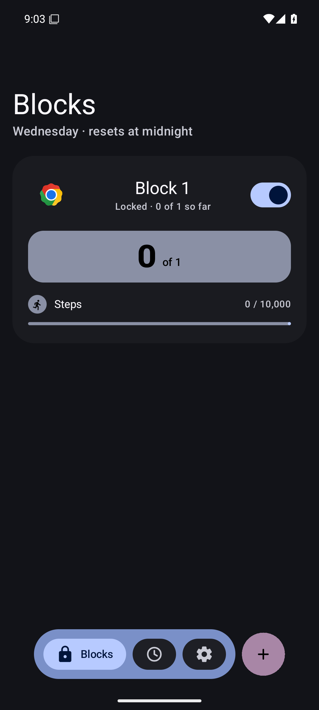
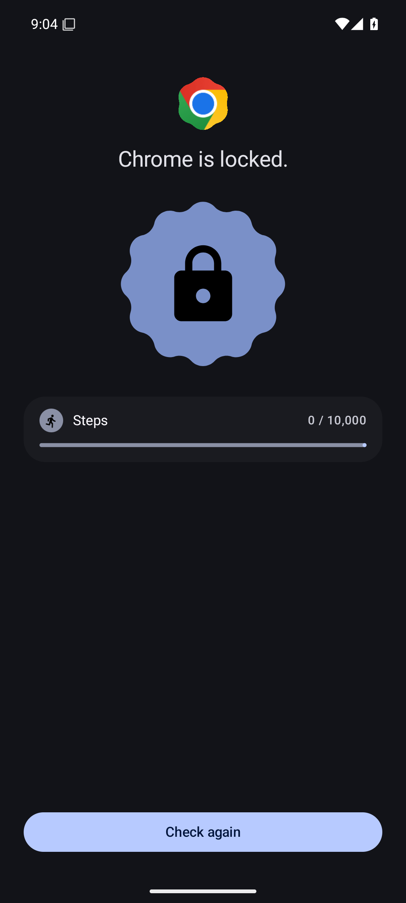

# Hablock

A playful, fully-offline Android app blocker that opens your distracting apps only after the
day's habits are done.

<p align="center">
  <a href="https://apps.obtainium.imranr.dev/redirect?r=obtainium://app/%7B%22id%22%3A%22dev.hablock.app%22%2C%22url%22%3A%22https%3A%2F%2Fgithub.com%2Fzdrng%2Fhablock%22%2C%22author%22%3A%22zdrng%22%2C%22name%22%3A%22Hablock%22%7D">
    
  </a>
  &nbsp;
  <a href="https://github.com/zdrng/hablock/releases">
    
  </a>
</p>

Pick the apps that steal your evenings ("Blocks"), attach conditions — minutes in a helper app,
steps, workout or meditation minutes from Health Connect — and choose how many of them (N of M)
unlock the day. Opening an unlocked app starts a 30-minute session; when it ends, each met
condition's requirement ratchets up a little, so the next session costs slightly more. Everything
resets at local midnight.

<p align="center">
  
  &nbsp;&nbsp;
  
</p>

## Highlights

- **No internet, no accounts.** The app does not hold the INTERNET permission — nothing it reads
  can leave the phone, enforced by the OS.
- **Habit-gated sessions with a ratchet.** Meeting today's goals buys a 30-minute session;
  goals nudge up after each unlock.
- **Two enforcement levels.** Out of the box, an accessibility service notices when a blocked
  app comes to the foreground and shows a lock screen over it. Optionally, device-owner mode
  suspends blocked apps at the OS level and makes Hablock itself uninstall-proof.
- **A deliberate exit.** Giving up device-owner mode requires a 3-day cooldown — long enough to
  outlast a weak moment, short enough to stay reversible.
- **Material 3 Expressive UI** with Material You dynamic color.

## Building

With [Nix](https://nixos.org) (pinned toolchain — JDK 17, Android SDK, Gradle 8):

```sh
nix develop -c gradle assembleDebug
nix develop -c gradle test
```

Without Nix you need JDK 17 and an Android SDK (platform 36, build-tools 36.0.0) with
`ANDROID_HOME` set:

```sh
./gradlew assembleDebug
./gradlew test
```

Install: `adb install -r app/build/outputs/apk/debug/app-debug.apk`. Debug builds shorten
sessions to 1 minute for easier testing.

Release builds are signed via a local `keystore.properties` + keystore (not in the repo — see
`app/build.gradle.kts` for the expected properties; generate your own with `keytool`).

## Permissions & privacy

Hablock asks for a lot of sensitive access, so here is exactly what each permission does:

| Permission | Used for |
|---|---|
| Accessibility service | Only to notice which app comes to the foreground so blocked apps can be locked. `canRetrieveWindowContent` is off — it never reads screen content. |
| Usage access | Counting foreground minutes in helper apps and the Screen Time view. |
| Health Connect (read steps / exercise / mindfulness) | Evaluating step, workout and meditation conditions for today's window. |
| Exact alarms | Ending sessions and resetting the day on time. Without it, re-locks fire up to 2 minutes late. |
| Notifications | A heads-up when a session ends or the relinquish timer completes. |

There is **no INTERNET permission**, no analytics, no accounts. All data lives in a local
DataStore file.

## Device-owner mode (optional)

Device-owner mode suspends blocked apps at the OS level and prevents uninstalling Hablock.
It can only be granted on a device without other accounts/work profiles, via adb:

```sh
adb shell dpm set-device-owner dev.hablock.app/.system.HablockDeviceAdminReceiver
```

To hand back control, start the relinquish timer in Settings; after the 3-day cooldown you can
confirm, which unsuspends everything, drops ownership, and makes the app uninstallable again.
(A factory reset also always works.)

## Architecture

Single Gradle module, manual DI (no Hilt), no Room/WorkManager/navigation-compose:

- `domain/` — pure Kotlin: models, gate math (`GateEvaluator`, `SessionMath`), the
  `DefaultGateEngine` orchestrator, repository interfaces. Zero Android imports, enforced by a
  unit test (`ArchitectureTest`).
- `data/` — DataStore + kotlinx.serialization, UsageStatsManager, Health Connect,
  DevicePolicyManager implementations.
- `enforcement/` — the two enforcement backends behind an `EnforcementCoordinator`.
- `system/` — accessibility service (a dumb foreground sensor with zero policy), broadcast
  receivers, alarms, notifications.
- `ui/` — Jetpack Compose + ViewModels, Material 3 Expressive.

JVM unit tests cover the domain layer (`nix develop -c gradle test`); hand-written fakes, no
mocking library.

Known i18n caveat: compact duration tokens ("2h 15m") and the day header are formatted in code
and not yet translatable; everything else lives in `res/values/strings*.xml`.

## License

[GPL-3.0-only](LICENSE).
